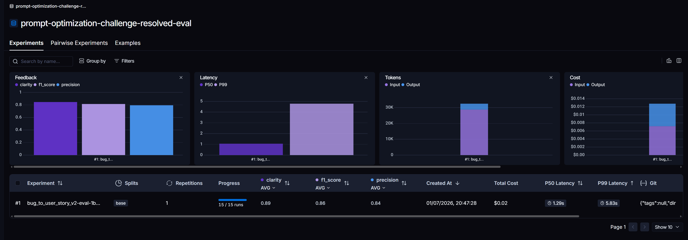
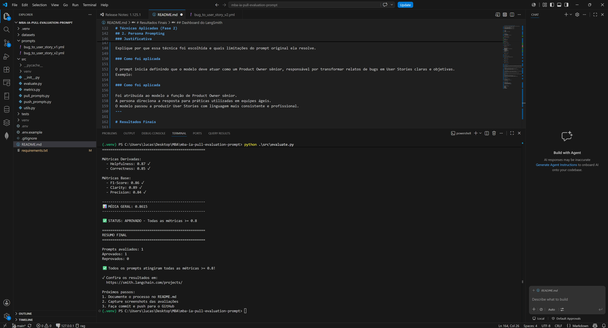
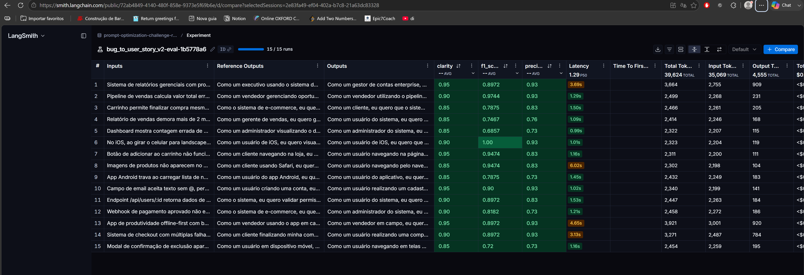

# Pull, Otimização e Avaliação de Prompts com LangChain e LangSmith

Projeto desenvolvido para a disciplina de Engenharia de Prompts do MBA em Inteligência Artificial.

O objetivo é realizar o ciclo completo de engenharia de prompts:

- Fazer pull de um prompt do LangSmith Hub;
- Refatorar utilizando técnicas avançadas de Prompt Engineering;
- Publicar a nova versão do prompt;
- Avaliar automaticamente utilizando LangSmith;
- Atingir nota mínima **0.8** em todas as métricas de avaliação.

---

# Tecnologias

- Python 3.9+
- LangChain
- LangSmith
- Google Gemini 2.5 Flash (ou OpenAI)

---

# Como Executar

## Pré-requisitos

- Python 3.9 ou superior
- Conta no LangSmith
- Chave de API do LangSmith
- Chave de API da OpenAI ou Google AI Studio

## 1. Clonar o projeto

```bash
git clone <url-do-repositorio>
cd mba-ia-pull-evaluation-prompt
```

## 2. Criar o ambiente virtual

### Windows

```bash
python -m venv .venv
.venv\Scripts\activate
```

### Linux / Mac

```bash
python -m venv .venv
source .venv/bin/activate
```

## 3. Instalar as dependências

```bash
pip install -r requirements.txt
```

## 4. Configurar as variáveis de ambiente

Copie o arquivo `.env.example`:

```bash
cp .env.example .env
```

Preencha o arquivo `.env`:

```env
LANGSMITH_TRACING=true
LANGSMITH_ENDPOINT=https://api.smith.langchain.com
LANGSMITH_API_KEY=
LANGSMITH_PROJECT=
USERNAME_LANGSMITH_HUB=

LLM_PROVIDER=google
LLM_MODEL=gemini-2.5-flash
EVAL_MODEL=gemini-2.5-flash

GOOGLE_API_KEY=
```

## 5. Fazer o Pull do Prompt

```bash
python src/pull_prompts.py
```

## 6. Refatorar o Prompt

Edite o arquivo:

```
prompts/bug_to_user_story_v2.yml
```

Aplicando as técnicas de Prompt Engineering escolhidas.

## 7. Publicar o Prompt

```bash
python src/push_prompts.py
```

## 8. Executar a Avaliação

```bash
python src/evaluate.py
```

## 9. Executar os Testes

```bash
pytest tests/test_prompts.py
```

---

# Técnicas Aplicadas (Fase 2)

## 1. Few-Shot Learning

### Justificativa

A técnica de Few-Shot Learning foi escolhida para fornecer ao modelo exemplos concretos de como transformar relatos de bugs em User Stories. Esses exemplos reduzem ambiguidades, aumentam a consistência das respostas e fazem com que o modelo reproduza com maior fidelidade a estrutura esperada, diminuindo variações de formato entre diferentes entradas.

### Como foi aplicada

Foram adicionados três exemplos completos ao final do prompt, cada um representando um nível diferente de complexidade do relato.

**Exemplo:**

- Foram adicionados três exemplos completos de conversão de bug para User Story.
- Os exemplos contemplam bugs simples, médios e complexos.
- O modelo passou a seguir de forma consistente o formato "Como um... Quero... Para que...".

---

## 2. Persona Prompting

> A definição de uma persona orienta o modelo a responder sob a perspectiva de um profissional experiente, aumentando a qualidade da linguagem utilizada, a aderência às boas práticas de Product Ownership e a consistência na elaboração das User Stories.

### Justificativa

Explique por que essa técnica foi escolhida e quais limitações do prompt original ela resolve.

### Como foi aplicada

O prompt inicia definindo que o modelo deve atuar como um Product Owner sênior, responsável por transformar relatos de bugs em User Stories claras e objetivas.
Exemplo:

### Como foi aplicada

Foi atribuída ao modelo a função de Product Owner sênior.
A persona direciona a resposta para práticas utilizadas em equipes ágeis.
O modelo passou a produzir User Stories com linguagem mais consistente e profissional.
---

# Resultados Finais

## Dashboard do LangSmith

**Link público:**

https://smith.langchain.com/public/72ab4849-4140-480f-858e-9373e5f69b6e/d
---

## Screenshots



---

# Evidências no LangSmith




---

# Estrutura do Projeto

```text
mba-ia-pull-evaluation-prompt/
├── prompts/
├── datasets/
├── src/
├── tests/
├── README.md
├── requirements.txt
└── .env.example
```